
 
<h1 style="color: #b76957;" align = "center">Store Management System</h1>

System which works as electronic notebook for keeping records.

 

### Hi welcome to this guide 😃 :
#### I have created this guide to help users who are new 👦 and old 👴 as well as to help them use this software to its full potential.
#### This guide will help you for installing and using this software.

 

## Table Of Contents:
1. [Installation Instructions](#installation-instructions)
2. [Usage Instructions](#usage-instructions)
3. [Compatibility](#compatibility)
4. [License](#license)

## Installation Instructions

### These are the detailed installation instructions to help you guide through the installation process.

#### First click on the icon of the software installer it will open a window where you will see two options.
#### One is `Install for me only (Recommended)` and another one is `Install for all users`. 
#### Choose the recommended option as it will not require any administrative permissions the other option will ask you for administrative permissions for installing and running the software.

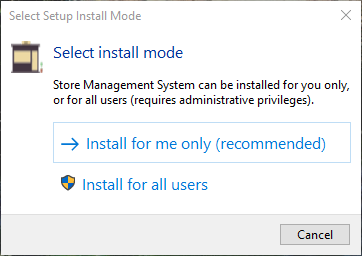

#### Once you choose the option then you have to agree on the license like in the image below.

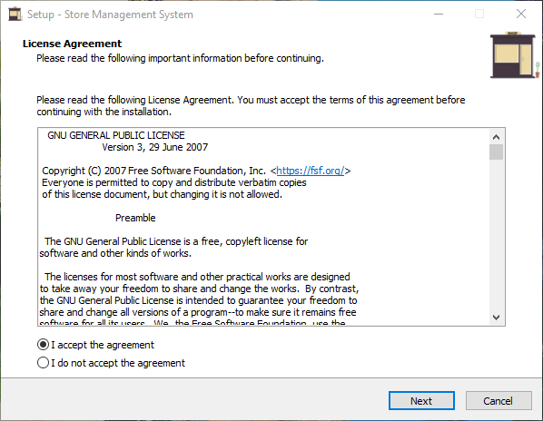

#### Now choose the destination for installing the software.

#### Next select start menu option.
#### The choice is yours. You can also change the folder`s name if you want then click next.

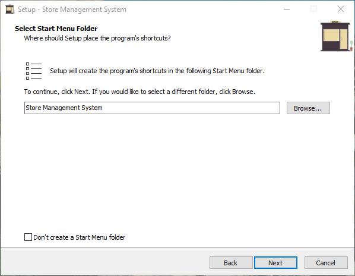

#### Next select if you want the shortcut or not.

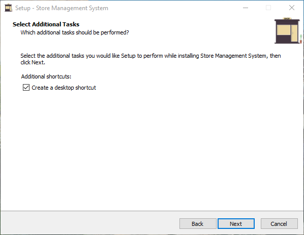

#### Then review the options again and install the software

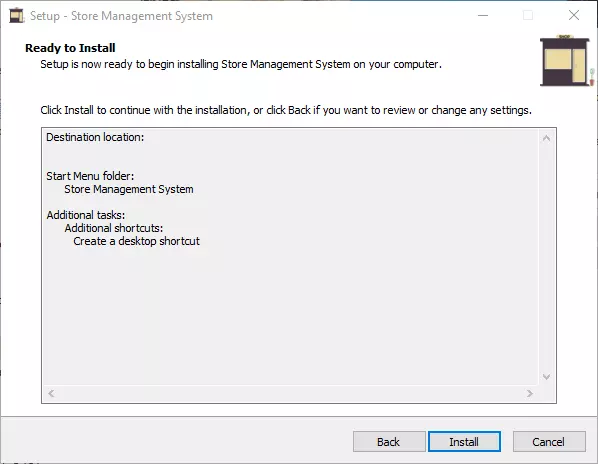

#### Once the process of installation is complete you can run the software.

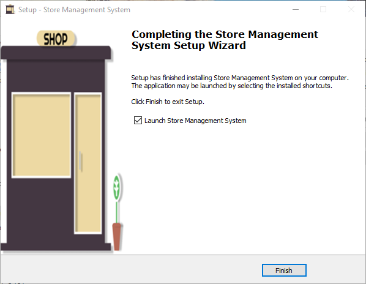

### ⚠️ If you have selected the `Install for all users` option then uncheck the option shown above or you will run into a minor permission problem like the one shown below.

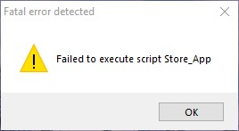

#### If you have selected the `Install for all users` option then right click on the icon of Store Management System and click `RUN AS ADMINISTRATOR` to open the application.

 

## Usage Instructions

### These are detailed usage instructions for this software to help you use the software.

#### When you will open the app for the first time you will be greeted by this message.

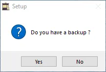

#### If you have an database backup present click yes and select folder named `Database_Backup` and click select folder.

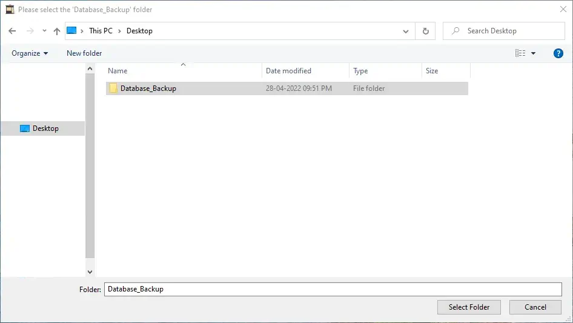

#### But if you do not have the backup click `No` button.
#### Now you will get a greeting message shown below click on `Ok` button.

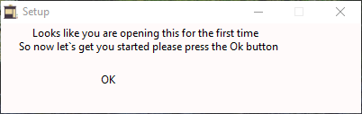

#### Next you will be prompted to create a Owner/Admin account create a username and a password for the account and click `Register` button.

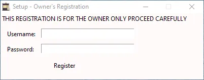

#### Next enter your shop's name, shop's registeration number, mobile number, shop's address as shown below.

#### Then click on the save button to complete the registeration process.

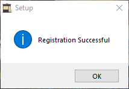

#### Click the icon of the app to open it. 
#### Remember if you have installed the app using `Install for all users` you have to open the app using `Run As Administrator` option.
#### Then enter the username and password.

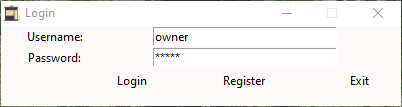

#### If you have any employee then set a username and passowrd and click register to register the employee in the database as shown below.

#### Once you have successfully logged in you will see the main page.

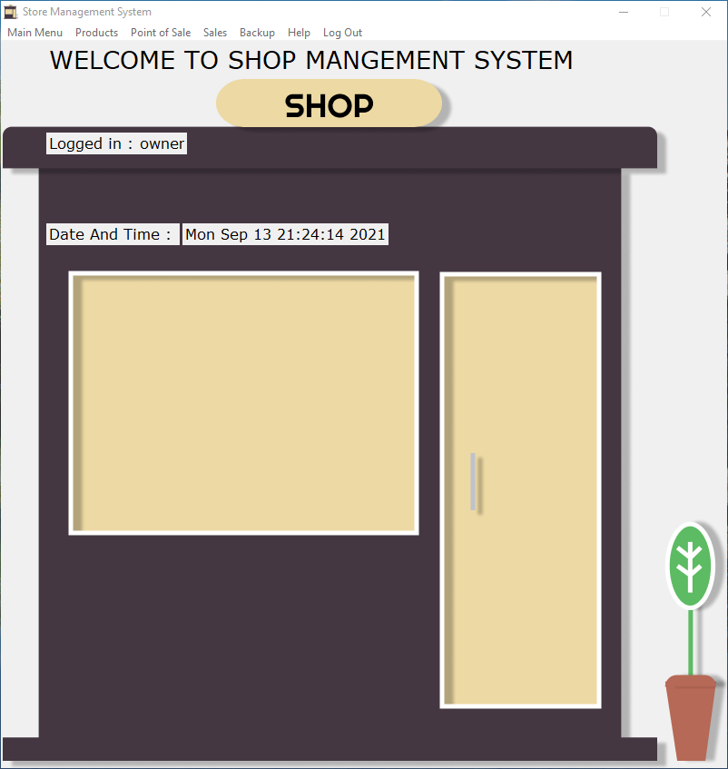

#### Let's explore the menubar options first is `Inventory Management` it has 4 sub option
##### (1) Product Registration
##### (2) Managing Product
##### (3) Finding Product
##### (4) Deleting Product

### Let`s see the (1) Product Registration page.

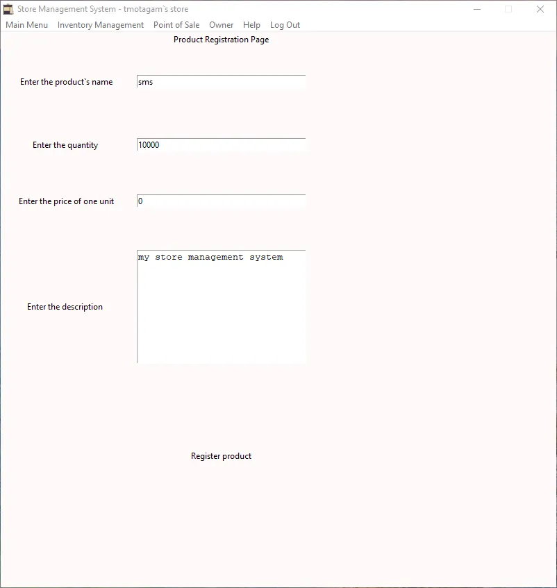

#### On this page you can register product, you have to enter name, quantity, price/unit and description and then you have to click the register product button.
#### Then the tax window will open in which you have to select one from three given option as shown below.

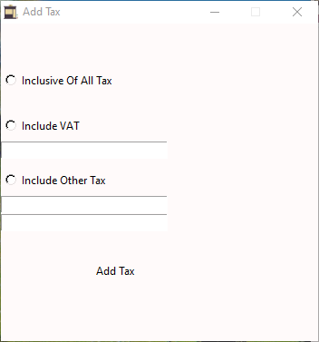

#### If you are adding `VAT` it will be added as a percentage same is true for the third option that is the other tax e.g If the vat is `2%` enter `2` in the vat entry see the above image for reference.

### Let`s see the (2) Manage Product page.

#### Previously for editing one field we have to edit all the fields now if we just want to edit one field we can do it easily no need to edit all the fields.

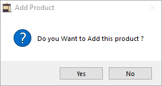

#### You can also edit tax information independently of every other fields.

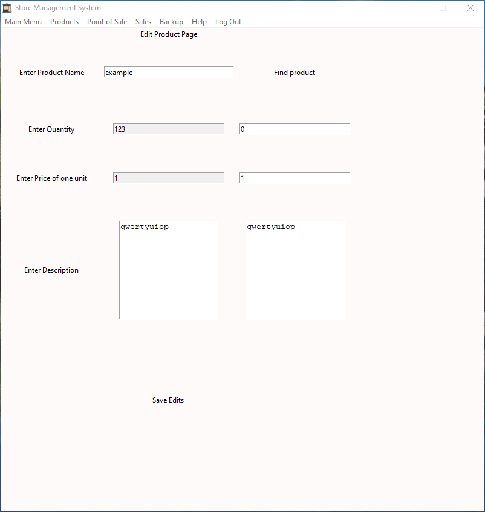

### Let`s see the (3) Find Product page.

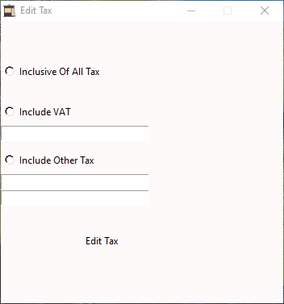

#### Enter the product name and it will give you the information about that product if available as shown above.
### Let`s see the (4) Delete Product page.

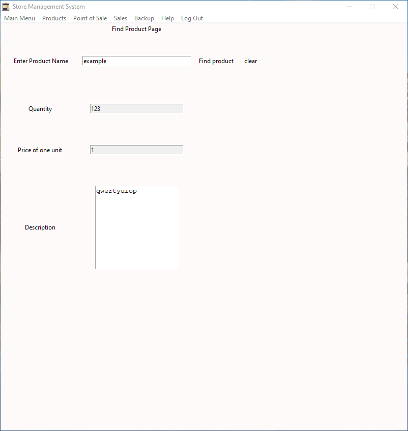

#### Enter the product name that you want to delete if the product exists it will delete it after taking confirmation from you.

#### Now the second menubar option is `Point of Sale`.

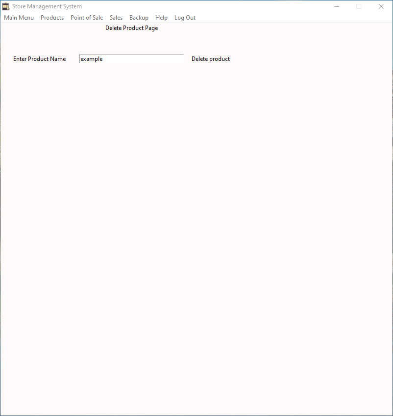

#### Enter the product's name then click on the search button based on the availability of the product it will give you status of the product.
#### It will also show you remaining quantity and price/unit enter the quantity required then click the `Add To Bill` button to add the product in the consumer bill.
#### You can also change the quantity of the added product you have to click the `Change` button then a popup will appear as shown below

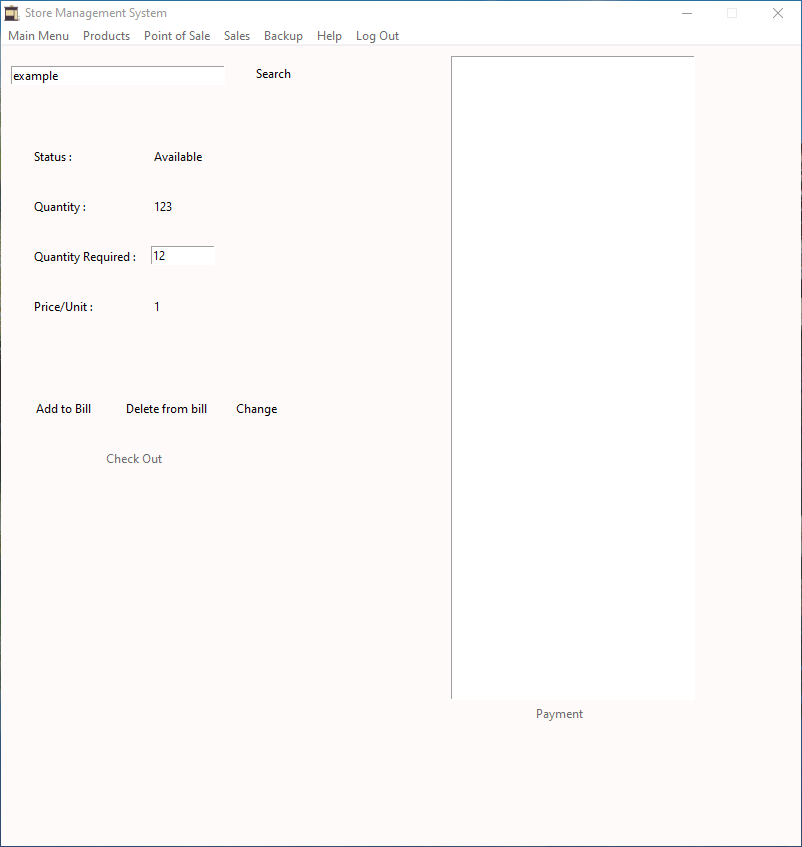

#### Click the product for which you want to change the quantity then enter the quantity and click on the `change` button to change the quantity.
#### If you want a previously added product to be removed from the bill click on the `Delete from bill` button then a popup will appear for deleting the required product from bill.

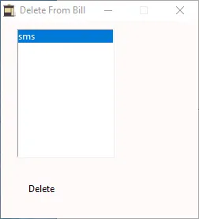

#### Select the product and click on the `delete` button to delete the selected product.
#### Once the order is completed click on the `Checkout` button to generate the bill and take payment from the customer.

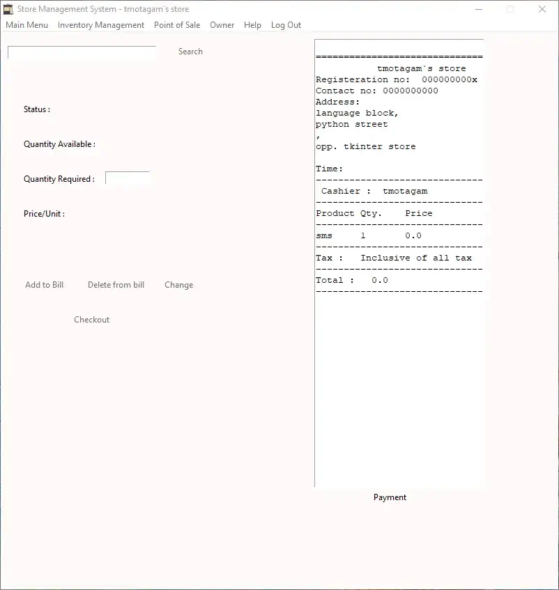

#### Now click on the `Payment` button for the payment options, there are two options in the payment window one is for the `cash` method and other is for the `non-cash` methods.

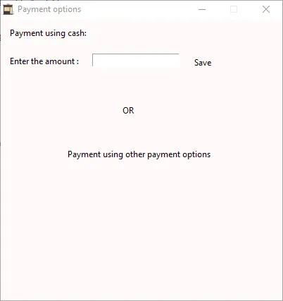

#### Now Enter the amount if the consumer gives you cash or else click on the `Payment using other payment options` button.
#### Once the payment is sucessful bill will be printed.

#### Now the third menubar option is `Owner` this will only be available to the owner of the application and not to the employees.
#### It has 2 sub option.
##### (1) Sales Analytics page
##### (2) Backup

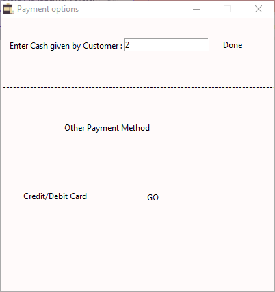

### Let`s see the (1) Sales Analytics page.
#### Enter name of employee or owner/your username to get all the sales the store has done till date as shown below.

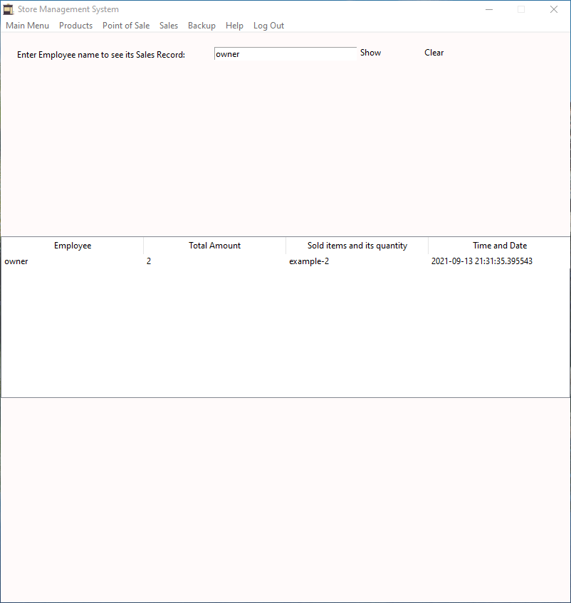

### Let`s see the (2) Backup
#### Click on the `owner` menu item and then click on the `backup` sub option to open the window as shown below to backup your data anywhere you like

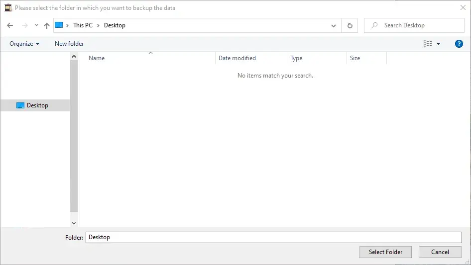

#### The last menubar option is `Help` option this has been updated for the new website

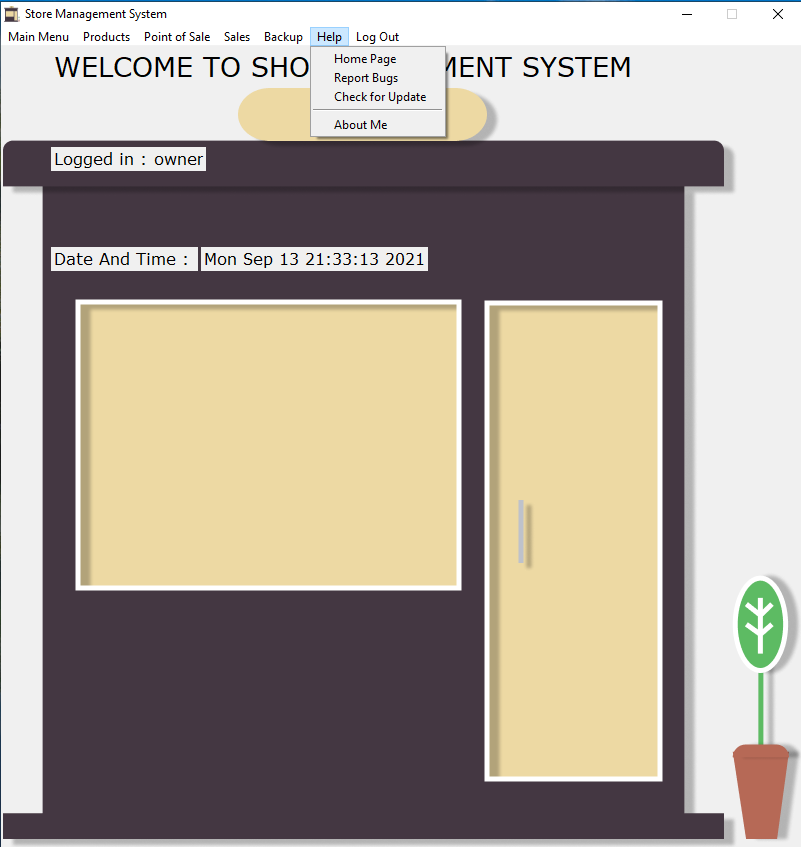

 

## Compatibility

#### Store Management System is compatible with windows 10, 8 or 8.1 and 7.

 

## License
[Store Management System is under license GNU-GPL - 3.0](https://www.gnu.org/licenses/gpl-3.0.en.html)

[This guide is also under license of GNU-FDL - 1.3](https://www.gnu.org/licenses/fdl-1.3.html)

 

### Thank You For Reading This Guide I Hope This Will Help You 👋 Bye.